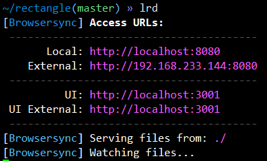

- vi编辑中，空格+w = 保存
- 打开多个vi编辑文件，[a用来切换到第一个文件
- browser-sync start --server --files   "目录文件"  后面的目录文件是可以自己定义的，也可以写成*，表示所有文件

## lrd（热加载）
- alias |grep lrd
    lrd="browser-sync start --server --port 8080 --no-open --files"

- External:访问网页的地址，加载的是真个目录
    URL：统一资源定位

## 矩形计算器
- vi index.html rectangle.* (进入三个文件)