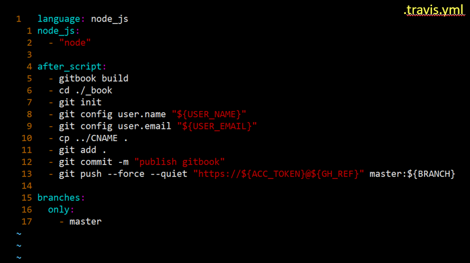

# 自动化构建--在线电子书

1. 手动构建电子书
- gitbook build 就是将md文件转化成html文件

2. 手动发布电子书
- 将生成的 _book 文件转移到其他临时目录下面
- 提交到远程仓库分支gh-pages上
> - git checkout -b gh-pages
> - 将临时目录里面的文件转移回到iBook文件下
> - git add .
> - git commit -m 'publish ibook'
> - git push -u origin gh-pages
- 增加新的章节

3. 引入自动化构建脚本 .travis.yml (切换到master分支下引入 git checkout master)

4. 修改 package.json ，并增加 travisCI 环境变量
- 生成package.json文件并修改 (npm init -y)

.png)

> - npm i -D gitbook-cli
> - 将test脚本中的"test": "echo \"Error: no test specified\" && exit 1"修改为"test": "echo \"Error: no test specified\" && exit 0"
> - "author": "" 添加作者名字
> - "license": "ISC" 修改为 "license": "MIT"

.png)

> - 关联travis-ci和github （https://travis-ci.com） ，然后找到电子书的仓库-->more option-->settings-->Environment Variables
> - 添加 BRANCH GH_REF USER_EMAIL USER_NAME 和 ACC_TOKEN
> - 找ACC_TOKEN，github-->settings-->Developer settings-->Personal access tokens-->New personal access token-->填写note，选择repo

5. 实现自动化构建

## 注意
- SUMMARY.md 电子书的目录文件即章节导航  （这些大写文件名的文件是具有特殊用途的文件）
- 全局安装 

    npm i -g gitbook-cli
    
    gitbook --version

    gitbook build 构建电子书（build就是将md文件转化为HTML文件）

    执行gitbook init 初始化GitBook，会在当前目录下生成 README.md 和 SUMMARY.md文件。SUMMARY.md是GitBook的目录文件。README.md是电子书介绍文件，必须存在。也可以先手动创建SUMMARY.md，再执行gitbook init，如果SUMMARY.md中配置的文件夹和文件不存在，就会自动创建文件夹和文件，已经存在的文件夹和文件不会被覆盖。一般情况下是先在gitbook-demo目录下执行gitbook init，然后将要制作文档的md文件放到gitbook-demo里，接着再修改SUMMARY.md。