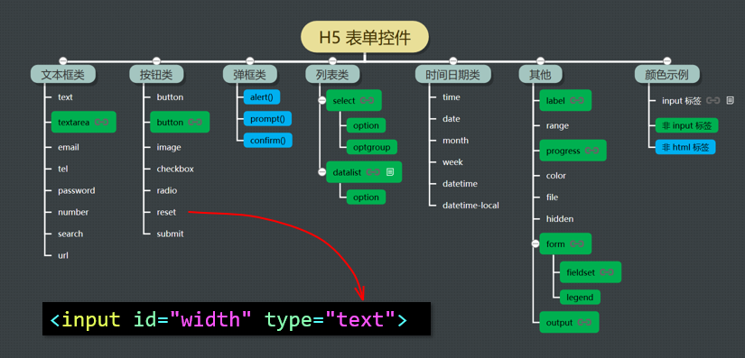
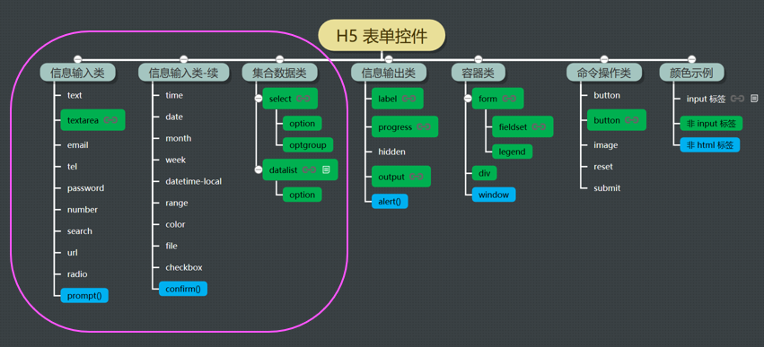
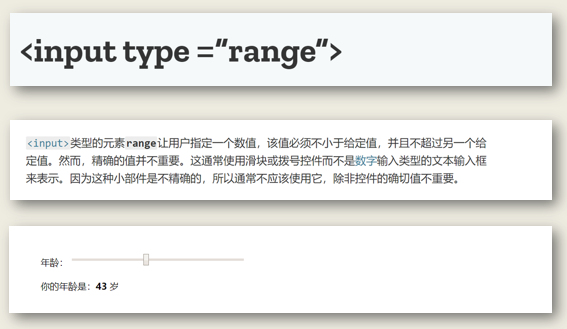
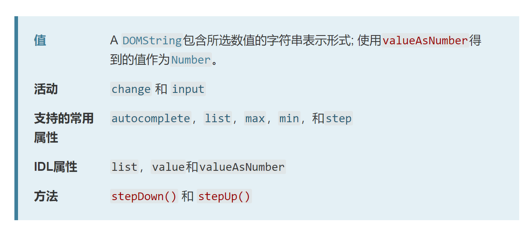
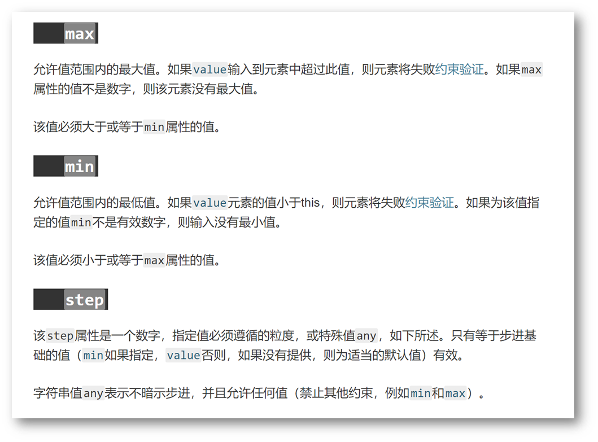
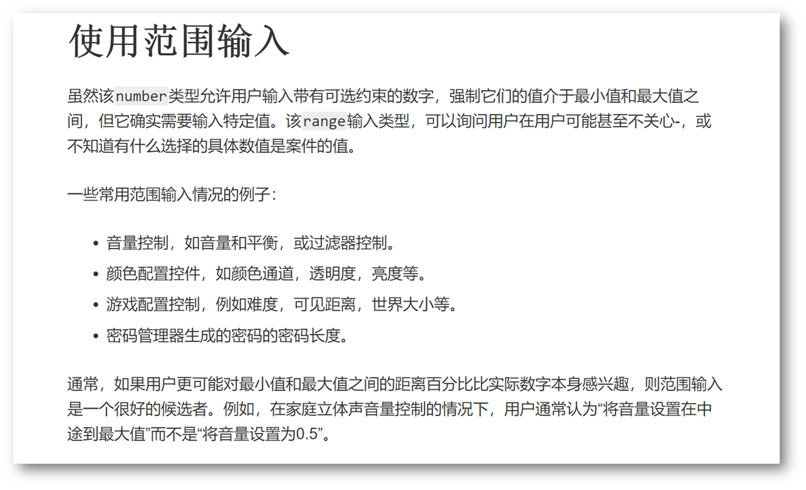

# 第四章 H5内置控件

- h5内置控件分类方法一：按照控件的外观或信息类型分类

  

- h5内置控件分类方法二：按照控件信息的输入、输出和操作，等功能分类

  
  
  > - 注意
  > 
  > 1. 输入类的控件一般同时可以用来输出，例如：矩形计算器中，面积和周长数据的输出用的是文本框。
  > 2. 但是输入类的控件一般会以输入信息为主要用途，用于输出，需要特别考虑一下，是否合适，当然，还需要设置控件 disable，屏蔽输入功能。
  > 3. 输出类的控件只能输出，没有任何歧义。
  > 4. 容器类的控件 page 相当于 HTML 标签中的 body，代表整个页面

- 属性、方法、事件  （面向对象基本编程的是三个要素）

  > - DOM 对象或者控件的属性和事件是 UI 编程的重点，属性，比如按钮控件，按钮上的文字是属性，按钮的样式是属性，按钮的状态是属性。属性决定这控件的外观和样式。事件控制交互，对于按钮控件，我们一般需要编写 Click 事件的响应代码。而控件的方法用的比较少。
  >
  > - GUI 界面编程的主要套路就是编写事件响应代码
  >
  >   事件响应代码就是对用户在界面上的交互或者操作进行处理和响应。在事件处理代码中做什么呢？
  >  1. 可以控制控件或者界面元素的属性，包括：文字内容、控件或界面元素的位置、颜色、外观，等
  >  2. 可以将用户输入的数据发送到服务器端，进行后台计算和处理
  >  3. 可以直接在浏览器里对用户的数据进行计算和处理，等

- HTML、CSS 和 JavaScript 代码分离的意义

  > 都写到 HTML 文件里有啥问题呢？
  >
  > - 不能代码自动补全，不知道补啥代码
  > - 不能代码静态检查，不知道查啥语法
  > - 不能单元测试，没有模块化
  >
  > 分开写，就是职责单一

- range 控件，概述和样式

  

- range 控件，属性、方法和事件

  

- range 控件，常用属性

  

- range 控件，使用场合

  