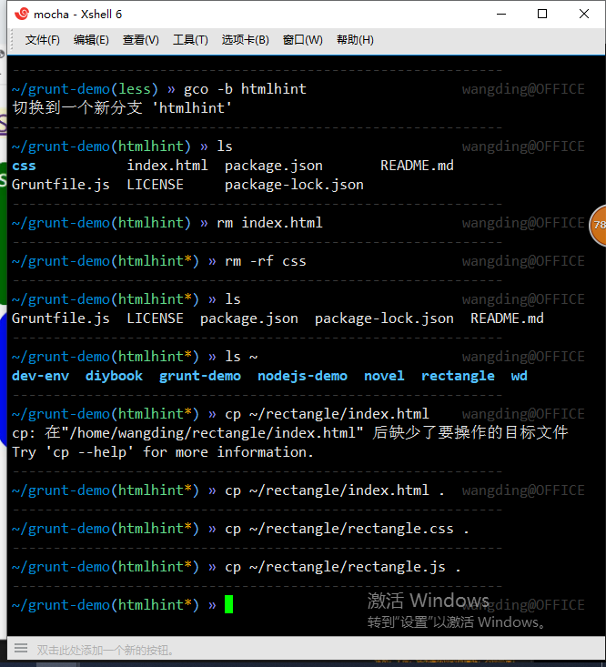
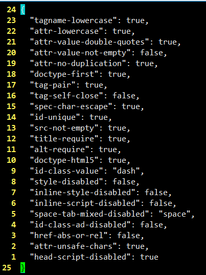
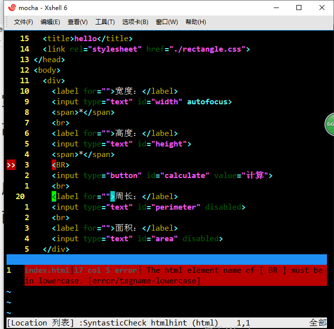
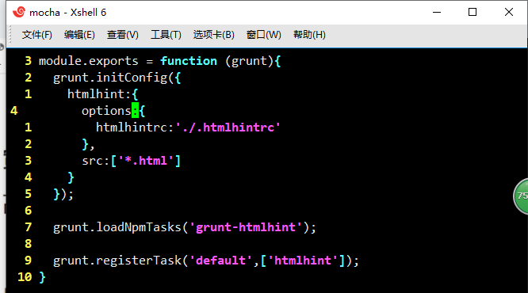
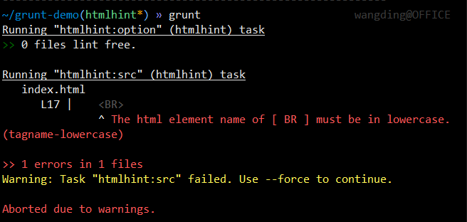
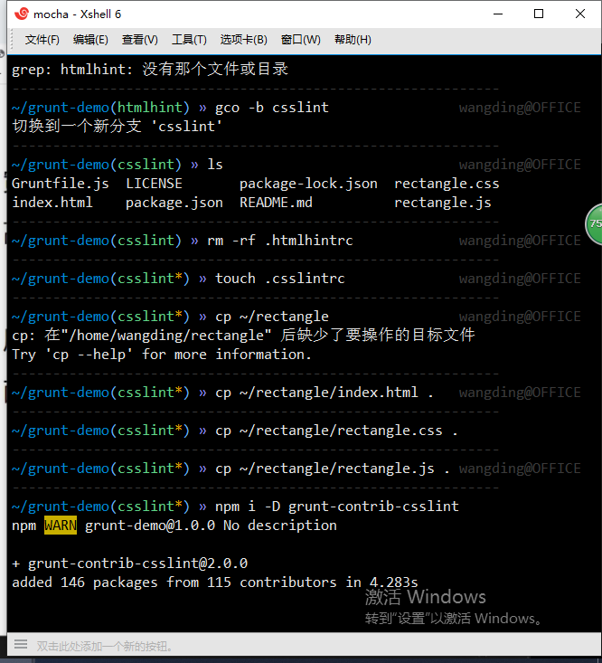

# 自动化构建--HTML 静态代码检查

[grunt-htmlhint插件文档](https://www.npmjs.com/package/grunt-htmlhint)
[htmlhint规则详解](https://segmentfault.com/a/1190000013276858)

1. 在 grunt-demo 仓库添加 htmlhint 分支

在 htmlhint 分支复制 rectangle 仓库的 index.html、rectangle.css 和 rectangle.js 三个代码文件

2. 创建并编辑规则配置文件 

> touch .htmlhintrc

3. 安装html静态代码检查插件

> npm i -D grunt-htmlhint 
> npm i

修改package.json文件

4. 修改Gruntfile.js文件

5. 执行任务

# 自动化构建--CSS 静态代码检查

[grunt-csslint插件文档](https://www.npmjs.com/package/grunt-contrib-csslint)
[csslint规则详解](https://github.com/CSSLint/csslint/wiki/Rules)

1. 在 grunt-demo 仓库添加 csslint 分支

在 csslint 分支复制 rectangle 仓库的 index.html、rectangle.css 和 rectangle.js 三个代码文件

2. 创建并编辑规则配置文件 

> touch .csslintrc

3. 安装html静态代码检查插件

> npm i -D grunt-contrib-csslint 
> npm i

修改package.json文件

4. 修改Gruntfile.js文件

5. 执行任务

### 注意

- alias |grep "命名的命令"  查看命令的初始命令
> alias |grep gsb
> gsb='git status -sb'
> 
> alias |grep gaa
> gaa='git add --all'
>
> alias |grep gcmsg
> gcmsg='git commit -m'